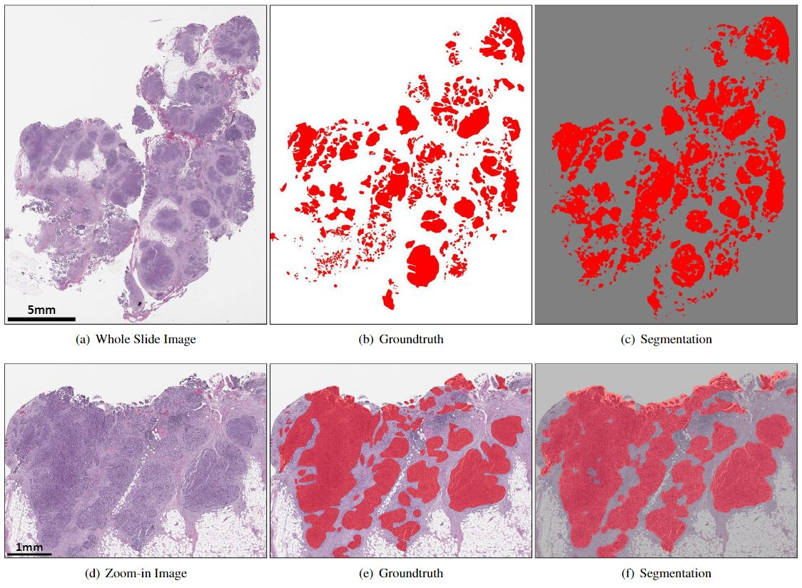

# Ovarian Cancer Segmentation
This repository provides source code for ovarian cancer segmentation using Deep Multi-Magnification Network. Deep Multi-Magnification Network automatically segments multiple tissue subtypes by a set of patches from multiple magnifications in histopathology whole slide images. The original Deep Multi-Magnification Network paper is published [here](https://doi.org/10.1016/j.compmedimag.2021.101866) and its training and inference codes can be found [here](https://github.com/MSKCC-Computational-Pathology/DMMN).

[](https://arxiv.org/abs/2203.15015)

## Prerequisites
* Python 3.6.7
* Pytorch 1.3.1
* OpenSlide 1.1.1
* Albumentations

## Inference
The main inference codes are `slidereader_coords.py` and `inference.py`. You first need to run `slidereader_coords.py` to generate patch coordinates to be segmented in input whole slide images. After generating patch coordinates, you may run `inference.py` to generate segmentation predictions of input whole slide images. The segmentation predictions will be saved under `imgs/` by default.

You may need to update the following variables before running `slidereader_coords.py`:
* `slides_to_read`: the list of whole slide images
* `coord_file`: an output file listing all patch coordinates

In adition to `model_path` and `out_path`, you may need to update the following variables before running `inference.py`:
* `n_classes`: the number of tissue subtype classes + 1
* `test file`: the list of patch coordinates generated by `slidereader_coords.py`
* `data_path`: the path where whole slide images are located

Please download **the pretrained ovarian model** [here](https://mskcc.box.com/s/ragtxbnaiqtsmykozgqk6qmr9917m2ay).

Note that segmentation predictions will be generated in 4-bit BMP format. The size limit for 4-bit BMP files is 2<sup>32</sup> pixels.

## License
This project is under the CC-BY-NC 4.0 license. See [LICENSE](LICENSE.md) for details. (c) MSK

## Acknowledgments
* This code is inspired by [pytorch-semseg](https://github.com/meetps/pytorch-semseg) and [MICCAI 2017 Robotic Instrument Segmentation](https://github.com/ternaus/robot-surgery-segmentation).

## Reference
If you find our work useful, please cite our [paper](https://doi.org/10.1016/j.jpi.2022.100160):
```
@article{ho2023,
  title={Deep Interactive Learning-based ovarian cancer segmentation of H&E-stained whole slide images to study morphological patterns of BRCA mutation},
  author={Ho, David Joon and Chui, M. Herman and Vanderbilt, Chad M. and Jung, Jiwon and Robson, Mark E. and Park, Chan-Sik and Roh, Jin and Fuchs Thomas J.},
  journal={Journal of Pathology Informatics},
  year={2023},
  volume={14},
  pages = {100160}
}
```
